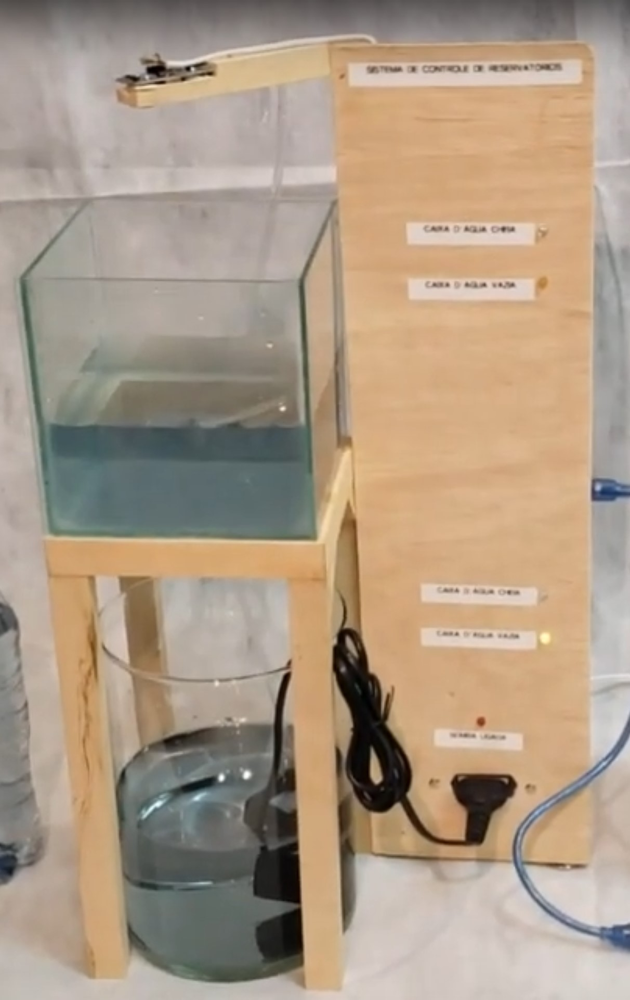

# Domótica aplicada ao controle de reservatórios de água em residência rural

Autores: **Alexandre Ricci Preuss, William Vilas Boas Gomes**

Professor Orientador: **Wallace Rodrigues de Santana**

---

_**Resumo:** Este repositório descreve o projeto em escala de um sistema para controle de dois reservatórios de água independentes, verificando as variações nos níveis de água e automatizando comandos para movimentação de água baseados critérios pré-estabelecidos, utilizando arduino._

**Figura 1 - Esquema de abastecimento de água do projeto proposto**

**Figura 2 - Protótipo em escala utilizado**

## Configuração

### Materiais utilizados:
- 01 Arduino Uno
- 01 Protoboard
- 01 Bomba de aquário
- 01 Relé
- 01 Led Vermelho
- 02 Leds Azuis
- 02 Leds Amarelos
- 02 Sensores Ultrassônicos (HC-SR04)
- 05 Resistores (1kΩ)
- Cabos jumpers para a conexão do materiais à placa e à protoboard

**Figura 3 - Configuração**

## Utilizando o código

Para a utilização do código, é necessária a instação do do software Arduino IDE. Após instalado, importar o código em Arquivo > Abrir..., ou utilizando o atalho CTRL + O.

Selecionar o arquivo 'monitoring-system.ino', dentro da pasta 'src/monitoring-system'.