# Domótica aplicada ao controle de reservatórios de água em residência rural

Autores: **Alexandre Ricci Preuss, William Vilas Boas Gomes**

Professor Orientador: **Wallace Rodrigues de Santana**

---

_**Resumo:** Este repositório descreve o projeto em escala de um sistema para controle de dois reservatórios de água independentes, verificando as variações nos níveis de água e automatizando comandos para movimentação de água baseados critérios pré-estabelecidos, utilizando arduino._

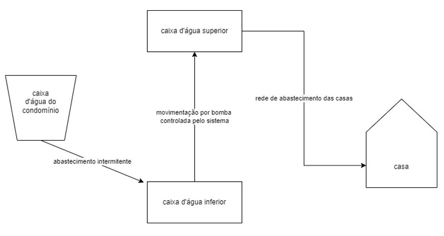

**Figura 1 - Esquema de abastecimento de água do projeto proposto**

a)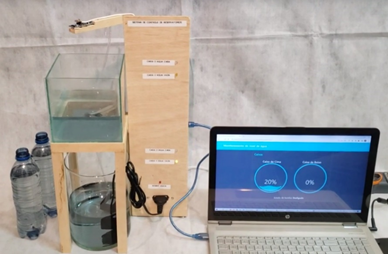 b)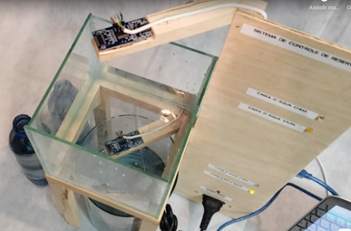

**Figuras 2a e 2b - Protótipo em escala utilizado e detalhe da montagem dos sensores**

<iframe width="560" height="315" src="https://www.youtube.com/embed/rkg3FCCqfL0" title="YouTube video player" frameborder="0" allow="accelerometer; autoplay; clipboard-write; encrypted-media; gyroscope; picture-in-picture" allowfullscreen></iframe>

---
## Funcionamento
### Sistema

O objetivo do sistema é realizar leitura dos níveis de água por meio dos sensores ultrassônicos, sendo um sensor para o reservatório de baixo e o outro para o de cima. O algoritimo converte os valores de leitura em centímetros e armazena nas variáveis _upperDistance_ e _bottomDistance_. Essas variáveis são analisadas no código, comparando-as com os valores de níveis mínimo e máximo (variáveis descritas no código) de seus respectivos reservatórios.

O algoritimo controla o acionamento da bomba d'água, verificando se atende as condições a seguir: caso o sensor do reservatório de baixo apresente a leitura de um nível de água acima do nível mínimo *e* o sensor do reservatório de cima apresente uma leitura de nível de água abaixo do máximo. Se as duas condições forem atendidas é acionado o relé e com isso o funcionamento da bomba, tranferindo a água do reservatório de baixo para o de cima.

O funcionamento da bomba é interrompido automaticamente em duas situações:

- caso o sensor de baixo realize uma leitura que iguale ou ultrapasse o nível mínimo do reservatório, prevenindo o esvaziamento do volume morto, necessário para o funcionamento da bomba;
- caso o sensor de cima realize uma leitura que iguale ou ultrapasse o nível máximo do reservatório, prevenindo o vazamento de água.

Existe também a possibilidde de um controle via internet, com a utilização do protocolo MQTT. Porém, há uma verificação no código para que esse controle atenda as condições acima, prevenido que ocorra o acionamento indevido da bomba.

Os dados gerados a cada ciclo de código são enviados para um servidor Node-Red, onde esses dados são analizados no fluxo abaixo e atualizam os tópicos publicados no Broker MQTT que por sua vez são utilizados para atualizar o dashboard de controle do projeto.

---

## Configuração

### Materiais necessários:
- 01 Placa Arduino Uno
- 01 Protoboard
- 01 Bomba de aquário
- 01 Relé (SRD-05VDC-SL-C)
- 01 Led Vermelho
- 02 Leds Azuis
- 02 Leds Amarelos
- 02 Sensores Ultrassônicos (HC-SR04)
- 05 Resistores (1kΩ)
- Cabos jumpers para a conexão do materiais à placa e à protoboard

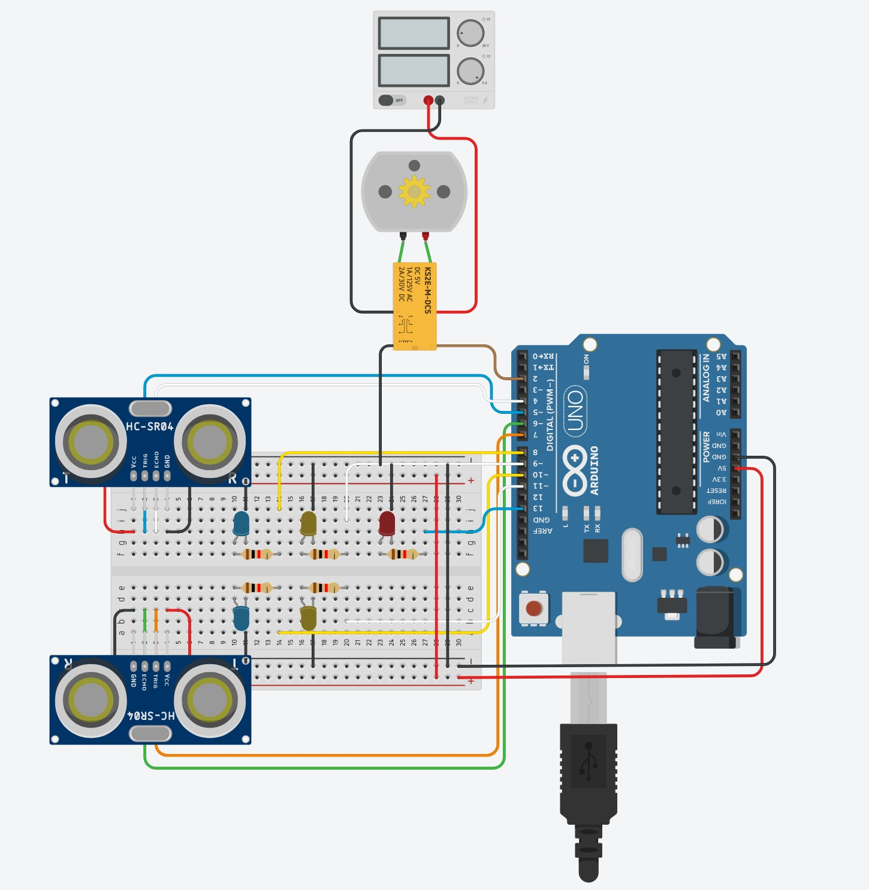

**Figura 3 - Configuração**

---

## Utilizando o código no Arduíno

Para a utilização do código na placa Arduíno é necessária a instação do do software Arduino IDE. Após instalado, importar o código em Arquivo > Abrir..., ou utilizando o atalho CTRL + O. Clique aqui para realizar o download do [Arduíno IDE](https://www.arduino.cc/en/software)

Selecionar o arquivo 'monitoring-system.ino', dentro da pasta 'src/monitoring-system' e carregar na placa Arduino.

## Servidor Node-RED
O Node-RED é uma ferramenta de programação baseada em fluxo (_flow_), originalmente desenvolvida pela IBM e atualmente faz parte da OpenJS Foundation.
A instalação do Node-RED é feita via npm (_Node Package Manager_), o gerenciador de pacotes do Node.js.
Inicialmente, o Node-RED disponibiliza algumas paletas básicas de nós (_nodes_), com os quais podemos criar de forma simples o fluxo, arrastando e conectando uns aos outros. Alguns nós permitem a programação via JavaScript. Além dos nós disponibilizados, podemos também adicionar diversas novas paletas e bibliotecas, como por exemplo, nós que possibilitam a utilização de dashboards. A criação e edição dos fluxos é realizada em qualquer navegador, após inicializar o Node-RED via terminal.

Para mais informações, acesse a [documentação do Node-RED](https://nodered.org/docs/)

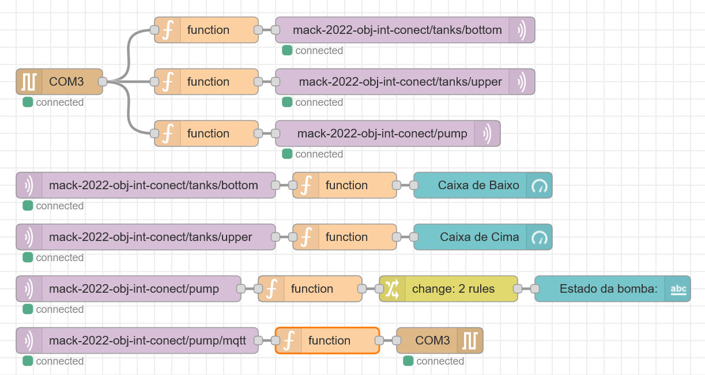

**Figura 4 - Fluxos**

**Obs:** Para a utilização do fluxo acima são necessários os nós 'node-red-node-serialport' e 'node-red-dashboard', que podem ser instalados via node-red na opção Manage palette. 
Para a utilização dos nós de conexão MQTT com o Broker é necessário criar antes os tópicos no Broker.

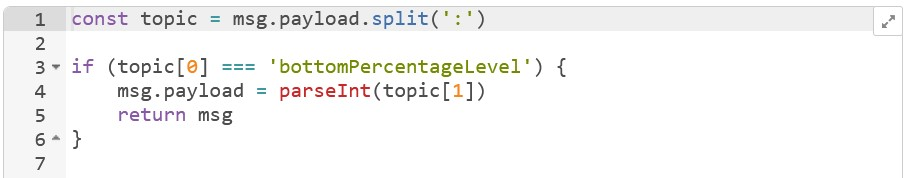

**Figura 5 - Código do nó function ligado ao tópico mack-2022-obj-int-conect/tanks/bottom**

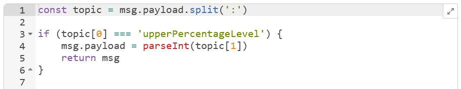

**Figura 6 - Código do nó function ligado ao tópico mack-2022-obj-int-conect/tanks/upper**

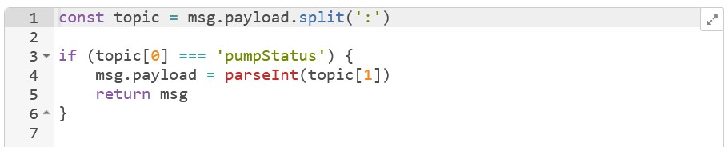

**Figura 7 - Código do nó function ligado ao tópico mack-2022-obj-int-conect/pump**

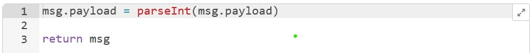

**Figura 8 - Código do nó function ligado ao tópico mack-2022-obj-int-conect/pump/mqtt**

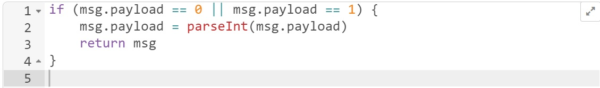

**Figura 9 - Código dos demais nós functions**

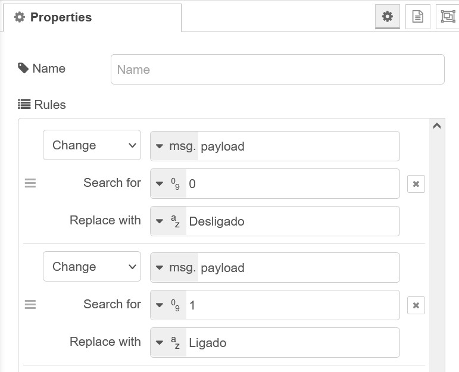

**Figura 10 - Configuração do nó change**

---

## Protocolo MQTT e Broker

O MQTT é um de protocolo de mensagens leves muito utilizado em Internet das Coisas (IoT - Internet of Things). A estrutura de comunicação é feita por meio de tópicos, os quais são endpoints onde podemos publicar ou ler uma variável no servidor Broker.

Para mais informações, acesse a [documentação do MQTT](https://mqtt.org/)

### Broker HiveMQ

Foi utilizado no projeto o [HiveMQ](https://mqtt.org/), um broker público e gratuito, que também possui um _Client_, no qual é possível publicar e se inscrever em tópicos, possibilitando a conexão via internet.

A configuração do Broker é bastante intuitiva, bastando criar uma conta e depois seguir as indicações para criar os tópicos. Crie um tópico para cada medida/variável e depois coloque os endereços nos nós do servidor Node-RED conforme descrito acima. 

Para variáveis de interação com o sistema Arduíno é necessário criar um fluxo de entrada conforme o último fluxo da Figura 4, com o código da Figura 8, terminando com o nó de transmitir via serial e depois tratar essa variável no código do Arduíno conforme a varíavel _mqttCommmand_ do código desse projeto.
